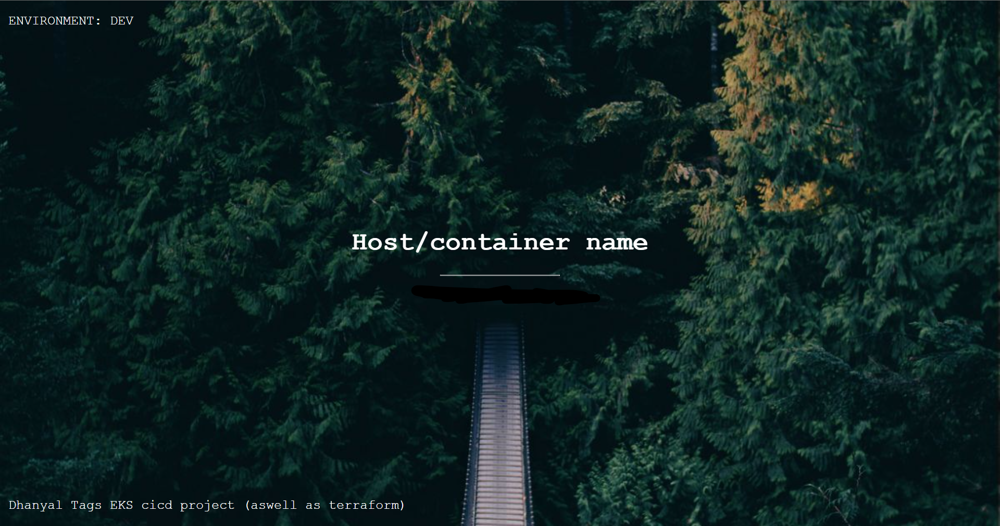

# AutoTerraformEKS-CI/CD

Automated Infrastructure Deployment and CI/CD with Terraform, EKS, and GitHub Actions

# Website Link
  http://my-eks-alb-869808185.us-west-1.elb.amazonaws.com

## Table of Contents

- [Introduction](#introduction)
- [Features](#features)
- [Installation](#installation)
- [Usage](#usage)
- [Deployment](#deployment)
- [Technologies](#technologies)

## Introduction

The Automated Infrastructure Deployment and CI/CD project aims to automate the provisioning and management of infrastructure resources using Terraform and Kubernetes. It provides a streamlined approach for deploying infrastructure components such as virtual machines, networks, load balancers, and EKS clusters, along with a CI/CD pipeline for continuous integration and deployment of a JavaScript application to the EKS cluster. By combining infrastructure-as-code, containerization, and automation, this project enhances scalability, maintainability, and efficiency.

## Features

- Infrastructure-as-Code: Provision and manage infrastructure resources using Terraform.
- EKS Cluster Deployment: Automatically deploy an EKS cluster for hosting containerized applications.
- CI/CD Pipeline: Implement a CI/CD pipeline with GitHub Actions for continuous integration and deployment.
- Dockerized Application: Containerize the JavaScript application using Docker for easy deployment and scalability.
- Kubernetes Deployment: Utilize Kubernetes manifests to deploy the application to the EKS cluster.

## Installation

To install and run this project locally, follow these steps:

1. Clone the repository: `git clone https://github.com/TagDhanyal/AutoTerraformEKS-CI/CD`
2. Navigate to the project directory: `cd AutoTerraformEKS-CI/CD`
3. Install the necessary dependencies: `npm install`

## Usage

To use this project, follow these guidelines:

1. Configure the necessary credentials for your target cloud provider and GitHub Actions in the respective configuration files.
2. Define the desired infrastructure resources and Kubernetes manifests in the Terraform and YAML files.
3. Run `terraform init` to initialize the project.
4. Run `terraform plan` to preview the changes that will be made.
5. Run `terraform apply` to apply the changes and provision the infrastructure.
6. Use the provided Dockerfile to build a container image for your JavaScript application.
7. Deploy the application to the EKS cluster using the provided Kubernetes manifests.

## Deployment

To deploy this project, follow these steps:

1. Set up a CI/CD pipeline in GitHub Actions to automatically trigger infrastructure deployment and application deployment when changes are pushed to the repository.
2. Configure the necessary environment variables and secrets for the CI/CD pipeline.
3. Configure the pipeline to run the necessary Terraform commands, such as `terraform init`, `terraform plan`, and `terraform apply`, for infrastructure deployment.
4. Utilize the Kubernetes manifests (`deployment.yml`) to deploy the Dockerized JavaScript application to the EKS cluster.

## Technologies

This project utilizes the following technologies:

- Terraform: Infrastructure-as-Code tool for provisioning and managing infrastructure resources.
- Amazon EKS: Managed Kubernetes service for deploying and scaling containerized applications.
- Docker: Containerization platform for packaging the JavaScript application into a container image.
- Kubernetes: Container orchestration platform for managing and deploying containerized applications.
- GitHub Actions: CI/CD platform for automating the infrastructure and application deployment pipeline.

